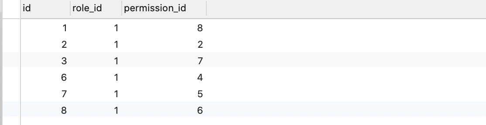
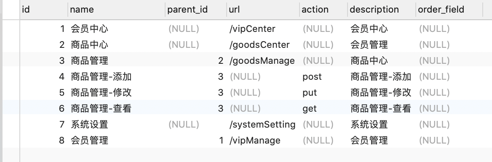

# quick-flask
快速的搭建一个flask-cli


## 使用说明

### 第一步
我们只要在resource中建立一个新的模块，模块内部一般会有三个文件：
1. models.py  - SQLAlchemy 定义的模型类
2. urls.py    - 蓝图
3. views.py   - 控制器


### 第二步
根目录```app.py```中引入resource下个个模块的蓝图（blueprint）注册
```python
def register_blueprints(flask_app):
    flask_app.register_blueprint(user_blueprint, url_prefix="/user")  # 用户
    flask_app.register_blueprint(auth_blueprint, url_prefix="/auth")  # 权限
    #     ...
```

### 第三步

权限表关系

```text
user -------- user_role -------- role -------- role_permission -------- permission
```

数据库中role_permission表数据添加

role_permission（角色权限表）中只需要添加 permission（权限）表的子数据就，接口中就能直接查询到它的父级并返回


如何在数据库中添加permission
